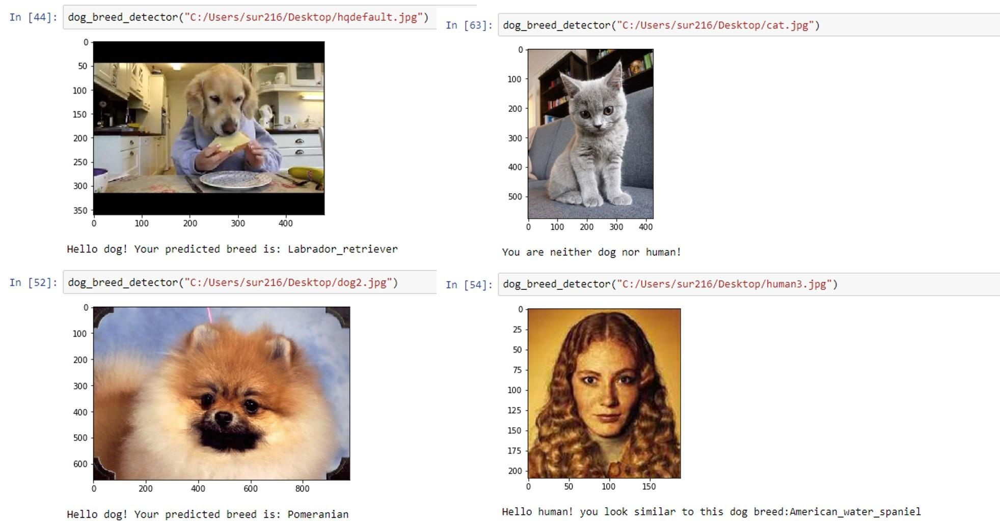

[//]: # (Image References)

[image1]: ./images/sample_dog_output.png "Sample Output"
[image2]: ./images/vgg16_model.png "VGG-16 Model Keras Layers"
[image3]: ./images/vgg16_model_draw.png "VGG16 Model Figure"


## Project Overview

 In this project, I will build a pipeline that can be used within a web or mobile app to process real-world, user-supplied images.  Given an image of a dog, your algorithm will identify an estimate of the canine’s breed.  If supplied an image of a human, the code will identify the resembling dog breed.  

![Sample Output][image1]


## Project Instructions

### Instructions

1. Clone the repository and navigate to the downloaded folder.
	
	```	
		git clone https://github.com/udacity/dog-project.git
		cd dog-project
	```
2. Download the [dog dataset](https://s3-us-west-1.amazonaws.com/udacity-aind/dog-project/dogImages.zip).  Unzip the folder and place it in the repo, at location `path/to/dog-project/dogImages`. 
3. Download the [human dataset](https://s3-us-west-1.amazonaws.com/udacity-aind/dog-project/lfw.zip).  Unzip the folder and place it in the repo, at location `path/to/dog-project/lfw`.  If you are using a Windows machine, you are encouraged to use [7zip](http://www.7-zip.org/) to extract the folder. 
4. Donwload the [VGG-16 bottleneck features](https://s3-us-west-1.amazonaws.com/udacity-aind/dog-project/DogVGG16Data.npz) for the dog dataset.  Place it in the repo, at location `path/to/dog-project/bottleneck_features`.
5. Obtain the necessary Python packages, and switch Keras backend to Tensorflow.  
	
	For __Mac/OSX__:
	```
		conda env create -f requirements/aind-dog-mac.yml
		source activate aind-dog
		KERAS_BACKEND=tensorflow python -c "from keras import backend"
	```

	For __Linux__:
	```
		conda env create -f requirements/aind-dog-linux.yml
		source activate aind-dog
		KERAS_BACKEND=tensorflow python -c "from keras import backend"
	```

	For __Windows__:
	```
		conda env create -f requirements/aind-dog-windows.yml
		activate aind-dog
		set KERAS_BACKEND=tensorflow
		python -c "from keras import backend"
	```
6. Open the notebook and follow the instructions.
	
	```
		jupyter notebook dog_app.ipynb
	```


#### (1) Augment the Training Data 

[Augmenting the training and/or validation set](https://blog.keras.io/building-powerful-image-classification-models-using-very-little-data.html) might help improve model performance. 

#### (2) Turn your Algorithm into a Web App

Turn this code into a web app using [Flask](http://flask.pocoo.org/) or [web.py](http://webpy.org/docs/0.3/tutorial)!  

#### (3) Overlay Dog Ears on Detected Human Heads

Overlay a Snapchat-like filter with dog ears on detected human heads.  You can determine where to place the ears through the use of the OpenCV face detector, which returns a bounding box for the face.  If you would also like to overlay a dog nose filter, some nice tutorials for facial keypoints detection exist [here](https://www.kaggle.com/c/facial-keypoints-detection/details/deep-learning-tutorial).

#### (4) Add Functionality for Dog Mutts

Currently, if a dog appears 51% German Shephard and 49% poodle, only the German Shephard breed is returned.  The algorithm is currently guaranteed to fail for every mixed breed dog.  Of course, if a dog is predicted as 99.5% Labrador, it is still worthwhile to round this to 100% and return a single breed; so, you will have to find a nice balance.  

#### (5) Experiment with Multiple Dog/Human Detectors

Perform a systematic evaluation of various methods for detecting humans and dogs in images.  Provide improved methodology for the `face_detector` and `dog_detector` functions.

### Some results


